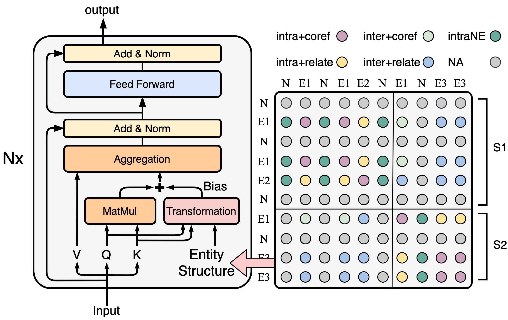

# SSAN
## Introduction
This is the pytorch implementation of the **SSAN** model (see our AAAI2021 paper: [Entity Structure Within and Throughout: Modeling Mention Dependencies
for Document-Level Relation Extraction](https://arxiv.org/abs/2102.10249)).  
**SSAN (Structured Self-Attention Network)** is a novel extension of Transformer to effectively incorporate structural dependencies between input elements.
And in the scenerio of document-level relation extraction, we consider the **structure of entities**.
Specificly, we propose a transformation module, that produces attentive biases based on the structure prior so as to adaptively regularize the attention flow within and throughout the encoding stage.
We achieve SOTA results on several document-level relation extraction tasks.  
This implementation is adapted based on [huggingface transformers](https://github.com/huggingface/transformers), the key revision is how we extend the vanilla self-attention of Transformers, you can find the SSAN model details in [`./model/modeling_bert.py#L267-L280`](./model/modeling_bert.py#L267-L280).
You can also find our paddlepaddle implementation in [here](https://github.com/PaddlePaddle/Research/tree/master/KG/AAAI2021_SSAN).
<div  align="center">  

</div>  


## Requirements
 * python3.6, pytorch==1.4.0, transformers==2.7.0  
 * This implementation is tested on a single 32G V100 GPU with CUDA version=10.2 and Driver version=440.33.01.


## Prepare Model and Dataset
 - Download pretrained models into `./pretrained_lm`.
For example, if you want to reproduce the results based on RoBERTa Base, you can download and keep the model files as:
```
    pretrained_lm
    └─── roberta_base
         ├── pytorch_model.bin
         ├── vocab.json
         ├── config.json
         └── merges.txt
```
Note that these files should correspond to huggingface transformers of version 2.7.0.
Or the code will automatically download from s3 into your `--cache_dir`.

 - Download [DocRED dataset](https://drive.google.com/drive/folders/1c5-0YwnoJx8NS6CV2f-NoTHR__BdkNqw) into `./data`, including `train_annotated.json`, `dev.json` and `test.json`.


## Train
 - Choose your model and config the script:  
Choose `--model_type` from `[roberta, bert]`, choose `--entity_structure` from `[none, decomp, biaffine]`.
For SciBERT, you should set `--model_type` as `bert`, and then add `do_lower_case` action.
 - Then run training script:
 
```
sh train.sh
```  
checkpoints will be saved into `./checkpoints`, and the best threshold for relation prediction will be searched on dev set and printed when evaluation.


## Predict
Set `--checkpoint` and `--predict_thresh` then run script:  
```
sh predict.sh
```
The result will be saved as `${checkpoint}/result.json`.  
You can compress and upload it to the official competition leaderboard at [CodaLab](https://competitions.codalab.org/competitions/20717#results).
```
zip result.zip result.json
```


## Citation
You can cite us as:
```
@article{xu2021entity,
  title={Entity Structure Within and Throughout: Modeling Mention Dependencies for Document-Level Relation Extraction},
  author={Xu, Benfeng and Wang, Quan and Lyu, Yajuan and Zhu, Yong and Mao, Zhendong},
  journal={arXiv preprint arXiv:2102.10249},
  year={2021}
}
```
